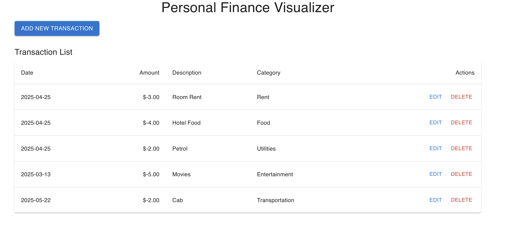
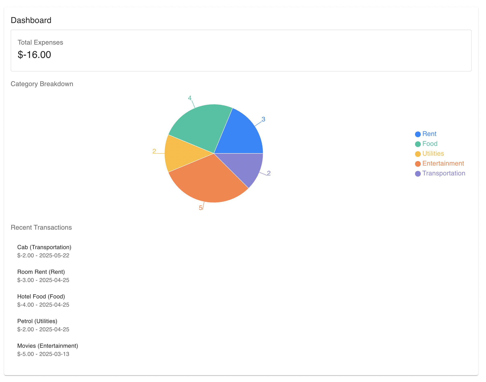
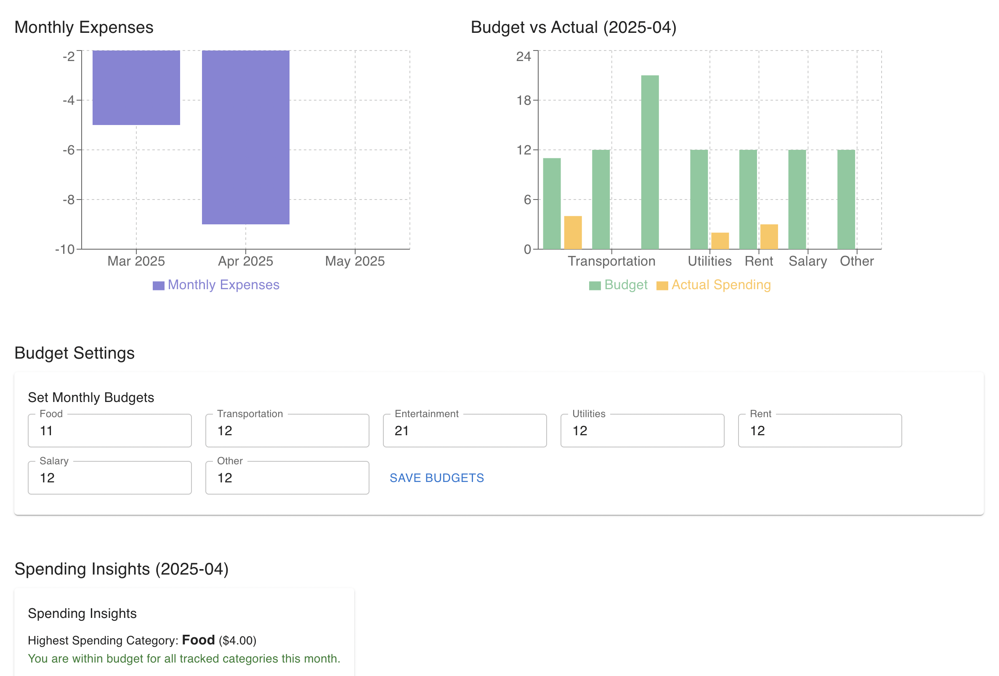

# Personal Finance Visualizer

A simple web application for tracking personal finances, built with ReactJS, MaterialUI, and Recharts.

## About the Project

This project allows users to:

* **Track Transactions:** Add, edit, and delete financial transactions with details like amount, date, description, and category.
* **Categorize Spending:** Assign predefined categories to transactions for better analysis.
* **Visualize Expenses:** View monthly expenses using a bar chart and category-wise spending using a pie chart.
* **Set Budgets:** Define monthly budgets for different spending categories.
* **Compare Budget vs. Actual:** See a visual comparison of budgeted versus actual spending for the current month.
* **Gain Insights:** Get simple spending insights, such as over-budget categories and the highest spending category.
* **Dashboard Overview:** View a summary of total expenses, category breakdown, and recent transactions.

## Common Requirements:
Stack: React, Material UI, Recharts
Responsive design with error states

## Stage 1: Basic Transaction Tracking  
- Add/Edit/Delete transactions (amount, date, -description)  
- Transaction list view
- Single chart: Monthly expenses bar chart
- Basic form validation

## Stage 2: Categories  
- All Stage 1 features +
- Predefined categories for transactions
- Category-wise pie chart
- Dashboard with summary cards: total expenses, category breakdown, most recent transactions

## Stage 3: Budgeting
- All Stage 2 features +
- Set monthly category budgets
- Budget vs actual comparison chart
- Simple spending insights

## Screenshots








## How to Run the App

Follow these steps to run the Personal Finance Visualizer on your local machine:

1.  **Clone the repository:**

    ```bash
    git clone https://github.com/ShramanaSarkar/personal-finance-visualizer
    cd personal-finance-visualizer
    ```


2.  **Install dependencies:**

    ```bash
    npm install
    # or
    yarn add
    ```

    This command will install all the necessary packages, including React, MaterialUI, Recharts, and date-fns.

3.  **Start the development server:**

    ```bash
    npm start
    # or
    yarn start
    ```

    This will start the React development server. Open your web browser and navigate to `http://localhost:3000` to view the application.

## Technologies Used

* **ReactJS:** A JavaScript library for building user interfaces.
* **MaterialUI (@mui/material):** A popular React UI framework implementing Google's Material Design.
* **Recharts:** A composable charting library built on React components.
* **date-fns:** A modern JavaScript date utility library.
* **@emotion/react and @emotion/styled:** CSS-in-JS libraries used by MaterialUI for styling.
* **@mui/x-date-pickers:** Advanced date and time picker components for MaterialUI.
* **@mui/icons-material:** Material Design icons for React.